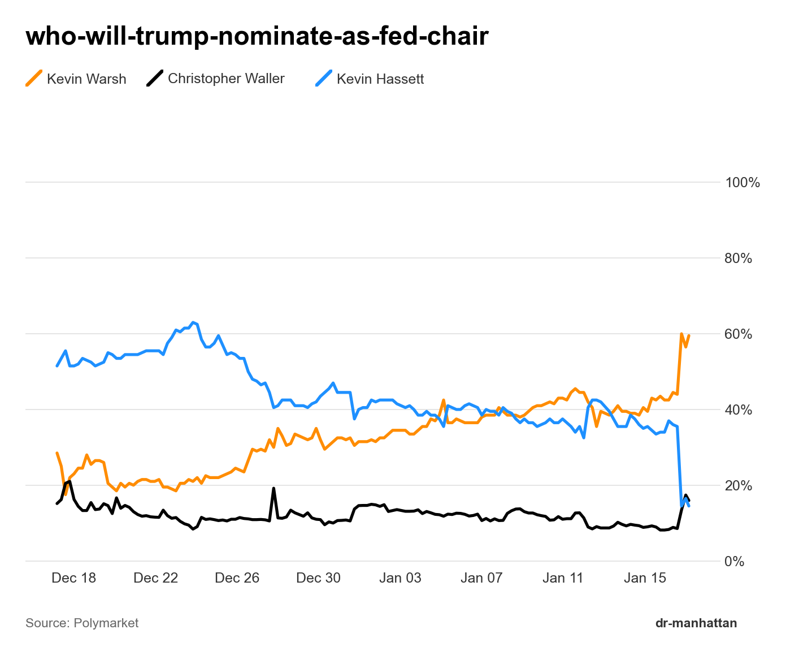

# Slug to Chart

Generate Bloomberg-style price charts from Polymarket event data.

## Usage

```bash
uv run python -m examples.slug_to_chart <slug> [options]
```

## Options

| Option | Description | Default |
|--------|-------------|---------|
| `--output`, `-o` | Output image path | `<slug>.png` |
| `--interval`, `-i` | Price history interval (1m, 1h, 6h, 1d, 1w, max) | `max` |
| `--fidelity`, `-f` | Number of data points | `300` |
| `--top`, `-t` | Show only top N outcomes by price | All |
| `--min-price`, `-m` | Min price threshold 0-1 to include | `0.001` (0.1%) |
| `--subtitle`, `-s` | Chart subtitle | None |

## Examples

```bash
# Basic usage
uv run python -m examples.slug_to_chart who-will-trump-nominate-as-fed-chair

# Show top 4 outcomes
uv run python -m examples.slug_to_chart democratic-presidential-nominee-2028 --top 4

# Custom output and subtitle
uv run python -m examples.slug_to_chart fed-decision-in-january -o fed.png -s "FOMC January 2025"

# Full URL also works
uv run python -m examples.slug_to_chart "https://polymarket.com/event/who-will-trump-nominate-as-fed-chair"
```

## Example Output



## Features

- Bloomberg-style chart design with clean aesthetics
- Smart x-axis date formatting based on data range
- Diagonal line markers in legend
- "dr-manhattan" watermark
- Binary markets show only "Yes" outcome
- Automatic label extraction from market questions
